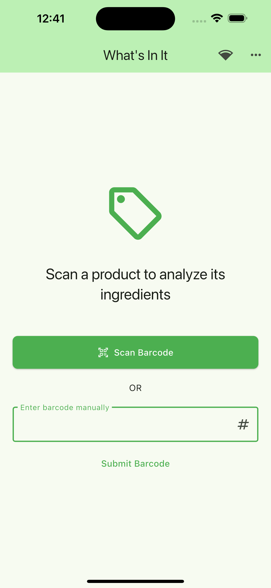
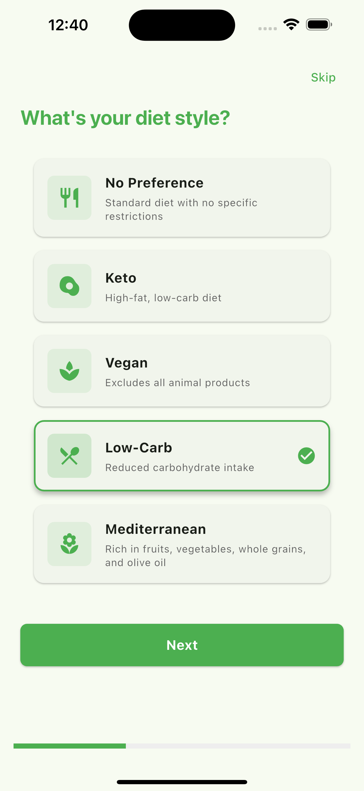
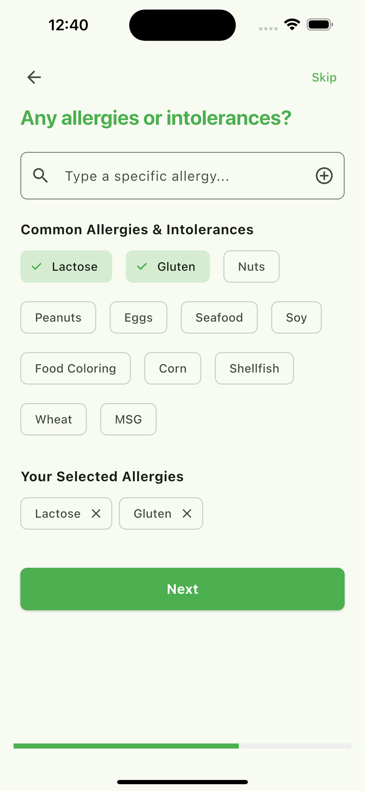
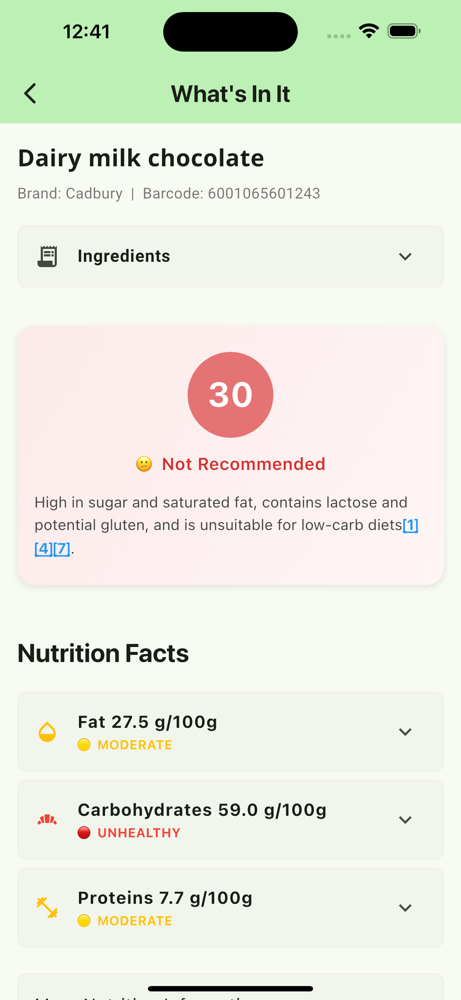
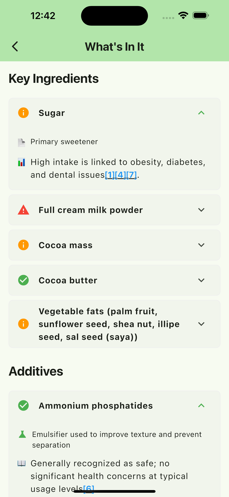
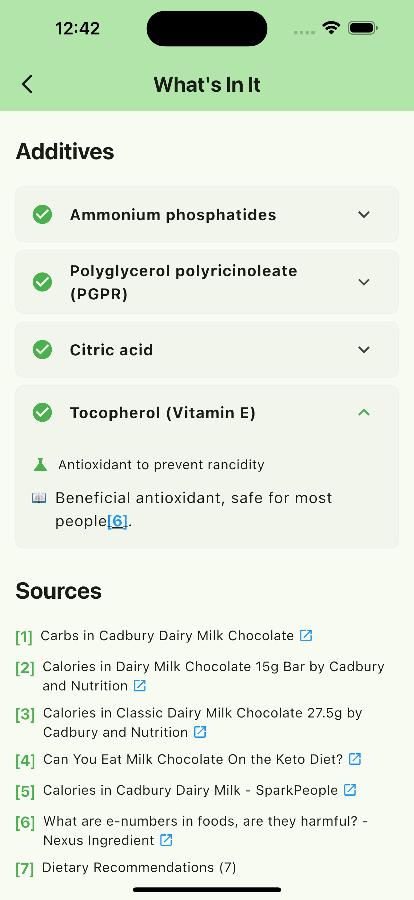

# What's In It

<div align="center">
  
  <p><strong>Know what's in your food - Smart food product analyzer</strong></p>
  
  [](https://whats-in-it.org/)
  [](https://github.com/lavande/Whats-In-It)
  [](https://flutter.dev)
</div>

## 🍎 About

"What's In It" is a cross-platform application that helps users analyze food products, their ingredients, additives, and nutritional information based on dietary preferences. Simply scan a barcode or enter it manually to get comprehensive information about what's in your food.

## 🚀 Try It Out

You can try the web version of the application at:
[https://whats-in-it.org/](https://whats-in-it.org/)

## ✨ Features

- 📱 **Cross-Platform Support**: Built with Flutter, runs on iOS, web, and more
- 📷 **Barcode Scanning**: Quickly identify products using your device's camera
- 🔍 **Detailed Analysis**: Get insights on additives, nutritional content, and more
- 🥗 **Dietary Preferences**: Personalized food analysis based on your diet
- ⚠️ **Allergen Detection**: Identify potential allergens in food products

## 📸 Screenshots

<div align="center">
  <table>
    <tr>
      <td align="center">
        <br/>
        <em>Main Screen</em>
      </td>
      <td align="center">
        <br/>
        <em>Settings Screen 1</em>
      </td>
      <td align="center">
        <br/>
        <em>Settings Screen 2</em>
      </td>
    </tr>
    <tr>
      <td align="center">
        <br/>
        <em>Analysis Result 1</em>
      </td>
      <td align="center">
        <br/>
        <em>Analysis Result 2</em>
      </td>
      <td align="center">
        <br/>
        <em>Analysis Result 3</em>
      </td>
    </tr>
  </table>
</div>

## 🏗️ Project Structure

The project consists of two main components:

- **Frontend**: Flutter application supporting multiple platforms (iOS, Web, etc.)
- **Backend**: FastAPI-based REST service for food product analysis

## 📝 Documentation

For more detailed information about each component:

- [Frontend Documentation](./frontend/README.md) - Flutter application details
- [Backend Documentation](./backend/README.md) - API and server details

## 🔧 Getting Started

### Prerequisites

- Flutter SDK (2.0.0 or higher)
- Python 3.8+ (for backend)
- APIs: OpenFoodFacts, Perplexity Sonar

### Installation

1. Clone the repository
   ```bash
   git clone https://github.com/lavande/Whats-In-It.git
   cd Whats-In-It
   ```

2. Set up the backend
   ```bash
   cd backend
   pip install -r requirements.txt
   cp .env.example .env
   # Edit .env with your API keys
   ```

3. Set up the frontend
   ```bash
   cd frontend/whatsinit
   flutter pub get
   ```

### Running the Application

1. Start the backend server
   ```bash
   cd backend
   uvicorn main:app --reload
   ```

2. Run the Flutter app
   ```bash
   cd frontend/whatsinit
   flutter run
   ```

## 📱 Platform Support

- ✅ **iOS**: Fully tested and supported
- ✅ **Web**: Available online via Vercel deployment
- 🔄 **Android**: Should work but not fully tested
- 🔄 **Other platforms**: May work but not specifically tested

## 📄 License

This project is licensed under the MIT License - see the LICENSE file for details.

## 🙏 Acknowledgements

- [OpenFoodFacts](https://world.openfoodfacts.org/) for their extensive food database
- [Perplexity Sonar API](https://perplexity.ai/) for AI-powered analysis with sources